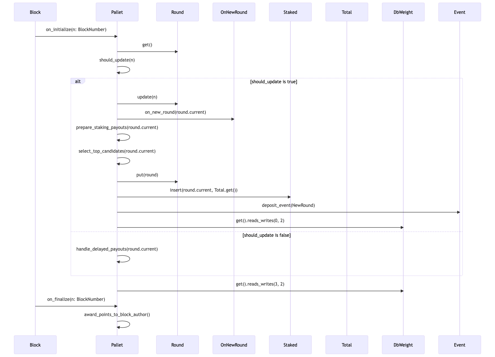
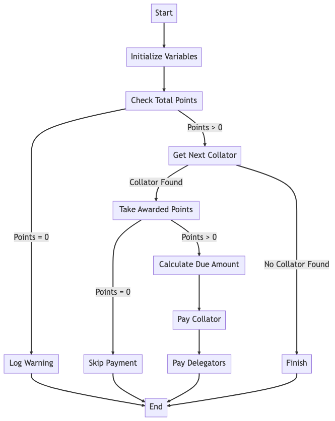

# Auto-Compound Research

## 1. Introduction

This report provides an in-depth analysis of Moonbeam's auto-compounding feature for staking rewards. The auto-compounding functionality is integrated within Moonbeam's parachain-staking module, allowing delegators to automatically reinvest their rewards by setting a specific auto-compounding percentage. The document is structured into three main sections: the first outlines how to configure auto-compounding, the second delves into its technical implementation, the third is how we are currently implement staking and what we need to do if we want to support auto-compounding.

## 2. Auto-Compounding Configuration

Moonbeam's auto-compounding feature is specifically designed for Delegators. There are two primary methods for configuring auto-compounding. The first method is `delegate_with_auto_compound`, where `amount` represents the sum delegated, and `auto_compound` specifies the percentage of rewards to be auto-compounded. The second method is `set_auto_compound`, which is used to adjust the auto-compounding reward percentage for an existing delegation.

```rust

#[precompile::public("delegateWithAutoCompound(address,uint256,uint8,uint256,uint256,uint256)")]
fn delegate_with_auto_compound(
    handle: &mut impl PrecompileHandle,
    candidate: Address,
    amount: U256,
    auto_compound: u8,
    candidate_delegation_count: Convert<U256, u32>,
    candidate_auto_compounding_delegation_count: Convert<U256, u32>,
    delegator_delegation_count: Convert<U256, u32>,
)

```

```Rust

#[precompile::public("setAutoCompound(address,uint8,uint256,uint256)")]
fn set_auto_compound(
    handle: &mut impl PrecompileHandle,
    candidate: Address,
    value: u8,
    candidate_auto_compounding_delegation_count: Convert<U256, u32>,
    delegator_delegation_count: Convert<U256, u32>,
) -> EvmResult

```

Each delegator's auto-compounding settings are stored in the `AutoCompoundDelegations` mapping. In this mapping, the key represents the candidate, while the value is a `BoundedVec` containing the delegator's specific auto-compounding configurations. The length of the `BoundedVec` is determined by the sum of `MaxTopDelegationsPerCandidate` and `MaxBottomDelegationsPerCandidate`.

```Rust

#[pallet::storage]
#[pallet::getter(fn auto_compounding_delegations)]
pub(crate) type AutoCompoundingDelegations<T: Config> = StorageMap<
    _,
    Blake2_128Concat,
    T::AccountId,
    BoundedVec<
        AutoCompoundConfig<T::AccountId>,
        AddGet<T::MaxTopDelegationsPerCandidate, T::MaxBottomDelegationsPerCandidate>,
    >,
    ValueQuery,
>;

/// Represents the auto-compounding amount for a delegation.
#[derive(Clone, Eq, PartialEq, Encode, Decode, RuntimeDebug, TypeInfo, PartialOrd, Ord)]
pub struct AutoCompoundConfig<AccountId> {
	pub delegator: AccountId,
	pub value: Percent,
}
```

## 3. Auto-Compound Implementation

Moonbeam's auto-compounding feature is built upon `#[pallet::hooks]`. The implementation is primarily divided into two segments: `on_finalize` and `on_initialize`. A sequence diagram for `#[pallet::hooks]` is illustrated as follows: 

#### 3.1 on_initialize

Moonbeam introduces the concept of a "Round," as shown in the following code snippet:

```Rust
/// The current round index and transition information
pub struct RoundInfo<BlockNumber> {
	/// Current round index
	pub current: RoundIndex,
	/// The first block of the current round
	pub first: BlockNumber,
	/// The length of the current round in number of blocks
	pub length: u32,
}
```

By default, a Round consists of 1800 blocks.

##### 3.1.1 When a Round Needs to be Updated

When a round update is required, the following actions are taken:
- Update Round Information: The status of the current round is updated.
- Trigger New Round Event: The `T::OnNewRound::on_new_round` function is invoked to signal the commencement of a new round.
- Prepare Reward Payments: Payments are prepared for all stakers from rounds prior to `T::RewardPaymentDelay`.
- Select Top Candidates: By default, a maximum of 8 candidates are selected.
- Initiate New Round: The new round information is stored back onto the blockchain.
- Snapshot Staked Data: A snapshot of the current total staked amount is stored.
- Publish New Round Event: An event containing the new round information is emitted.

The corresponding code is as follows:

```Rust
// mutate round
round.update(n);
// notify that new round begin
weight = weight.saturating_add(T::OnNewRound::on_new_round(round.current));
// pay all stakers for T::RewardPaymentDelay rounds ago
weight = weight.saturating_add(Self::prepare_staking_payouts(round.current));
// select top collator candidates for next round
let (extra_weight, collator_count, _delegation_count, total_staked) =
    Self::select_top_candidates(round.current);
weight = weight.saturating_add(extra_weight);
// start next round
<Round<T>>::put(round);
// snapshot total stake
<Staked<T>>::insert(round.current, <Total<T>>::get());
Self::deposit_event(Event::NewRound {
    starting_block: round.first,
    round: round.current,
    selected_collators_number: collator_count,
    total_balance: total_staked,
});
// account for Round and Staked writes
weight = weight.saturating_add(T::DbWeight::get().reads_writes(0, 2));

```

Among the various functions, we pay special attention to `prepare_staking_payouts` as it is closely related to auto-compounding.

###### 3.1.1.1 prepare_staking_payouts

The `prepare_staking_payouts` function primarily performs the following tasks:
- Determines whether rewards should be distributed for the current round; the default `delay` is set to 2.
- Calculates the total issuance (`total_issuance`) based on the staked amount.
- Allocates the `parachain_bond_reserve`, which by default is 30% of the `total_issuance`.
- Prepares Delayed Payout Information: Creates a `DelayedPayout` structure that contains the total issuance for the round (`total_issuance`), the remaining staking rewards (`left_issuance` = `total_issuance` * 70%), and the Collator's commission ratio (default `collator_commission` is 20%). This information is then stored in the `DelayedPayouts` storage map.

The corresponding code is as follows:
```Rust

pub(crate) fn prepare_staking_payouts(now: RoundIndex) -> Weight {
    // payout is now - delay rounds ago => now - delay > 0 else return early
    let delay = T::RewardPaymentDelay::get();
    if now <= delay {
        return Weight::zero();
    }
    let round_to_payout = now.saturating_sub(delay);
    let total_points = <Points<T>>::get(round_to_payout);
    if total_points.is_zero() {
        return Weight::zero();
    }
    let total_staked = <Staked<T>>::take(round_to_payout);
    let total_issuance = Self::compute_issuance(total_staked);
    let mut left_issuance = total_issuance;
    // reserve portion of issuance for parachain bond account
    let bond_config = <ParachainBondInfo<T>>::get();
    let parachain_bond_reserve = bond_config.percent * total_issuance;
    if let Ok(imb) =
        T::Currency::deposit_into_existing(&bond_config.account, parachain_bond_reserve)
    {
        // update round issuance iff transfer succeeds
        left_issuance = left_issuance.saturating_sub(imb.peek());
        Self::deposit_event(Event::ReservedForParachainBond {
            account: bond_config.account,
            value: imb.peek(),
        });
    }

    let payout = DelayedPayout {
        round_issuance: total_issuance,
        total_staking_reward: left_issuance,
        collator_commission: <CollatorCommission<T>>::get(),
    };

    <DelayedPayouts<T>>::insert(round_to_payout, payout);
    T::WeightInfo::prepare_staking_payouts()
}

```

###### 3.1.1.2 Select Top Candidates

The `select_top_candidates` function primarily accomplishes the following:
- Chooses the top `TotalSelected` qualified candidates as collators, ordered by stake, with a default maximum of 8.
- For each collator:
  - Retrieves rewardable delegators using the `get_rewardable_delegators` method.
  - Constructs a `BondWithAutoCompound` structure for each rewardable delegation. If a `delegator` has set `auto-compound`, the percentage for `auto-compound` is stored in the `auto_compound` attribute of `BondWithAutoCompound`, resulting in `rewardable_delegations`.
- Takes a snapshot of exposure for the round for weighting reward distribution, which is stored in the `AtStake` storage map.

The corresponding code is as follows:

```Rust

/// Best as in most cumulatively supported in terms of stake
/// Returns [collator_count, delegation_count, total staked]
pub(crate) fn select_top_candidates(now: RoundIndex) -> (Weight, u32, u32, BalanceOf<T>) {
    let (mut collator_count, mut delegation_count, mut total) =
        (0u32, 0u32, BalanceOf::<T>::zero());
    // choose the top TotalSelected qualified candidates, ordered by stake
    let collators = Self::compute_top_candidates();
    if collators.is_empty() {
        // SELECTION FAILED TO SELECT >=1 COLLATOR => select collators from previous round
        let last_round = now.saturating_sub(1u32);
        let mut total_per_candidate: BTreeMap<T::AccountId, BalanceOf<T>> = BTreeMap::new();
        // set this round AtStake to last round AtStake
        for (account, snapshot) in <AtStake<T>>::iter_prefix(last_round) {
            collator_count = collator_count.saturating_add(1u32);
            delegation_count =
                delegation_count.saturating_add(snapshot.delegations.len() as u32);
            total = total.saturating_add(snapshot.total);
            total_per_candidate.insert(account.clone(), snapshot.total);
            <AtStake<T>>::insert(now, account, snapshot);
        }
        // `SelectedCandidates` remains unchanged from last round
        // emit CollatorChosen event for tools that use this event
        for candidate in <SelectedCandidates<T>>::get() {
            let snapshot_total = total_per_candidate
                .get(&candidate)
                .expect("all selected candidates have snapshots");
            Self::deposit_event(Event::CollatorChosen {
                round: now,
                collator_account: candidate,
                total_exposed_amount: *snapshot_total,
            })
        }
        let weight = T::WeightInfo::select_top_candidates(0, 0);
        return (weight, collator_count, delegation_count, total);
    }

    // snapshot exposure for round for weighting reward distribution
    for account in collators.iter() {
        let state = <CandidateInfo<T>>::get(account)
            .expect("all members of CandidateQ must be candidates");

        collator_count = collator_count.saturating_add(1u32);
        delegation_count = delegation_count.saturating_add(state.delegation_count);
        total = total.saturating_add(state.total_counted);
        let CountedDelegations {
            uncounted_stake,
            rewardable_delegations,
        } = Self::get_rewardable_delegators(&account);
        let total_counted = state.total_counted.saturating_sub(uncounted_stake);

        let auto_compounding_delegations = <AutoCompoundingDelegations<T>>::get(&account)
            .into_iter()
            .map(|x| (x.delegator, x.value))
            .collect::<BTreeMap<_, _>>();
        let rewardable_delegations = rewardable_delegations
            .into_iter()
            .map(|d| BondWithAutoCompound {
                owner: d.owner.clone(),
                amount: d.amount,
                auto_compound: auto_compounding_delegations
                    .get(&d.owner)
                    .cloned()
                    .unwrap_or_else(|| Percent::zero()),
            })
            .collect();

        let snapshot = CollatorSnapshot {
            bond: state.bond,
            delegations: rewardable_delegations,
            total: total_counted,
        };
        <AtStake<T>>::insert(now, account, snapshot);
        Self::deposit_event(Event::CollatorChosen {
            round: now,
            collator_account: account.clone(),
            total_exposed_amount: state.total_counted,
        });
    }
    // insert canonical collator set
    <SelectedCandidates<T>>::put(
        BoundedVec::try_from(collators)
            .expect("subset of collators is always less than or equal to max candidates"),
    );

    let avg_delegator_count = delegation_count.checked_div(collator_count).unwrap_or(0);
    let weight = T::WeightInfo::select_top_candidates(collator_count, avg_delegator_count);
    (weight, collator_count, delegation_count, total)
}

```

##### 3.1.2 Round Should Not Be Updated

When it is determined that the round does not need to be updated, only one action is performed: handle delayed payouts. Moreover, only one collator is processed per round. The corresponding code is as follows:

```Rust

/// Wrapper around pay_one_collator_reward which handles the following logic:
/// * whether or not a payout needs to be made
/// * cleaning up when payouts are done
/// * returns the weight consumed by pay_one_collator_reward if applicable
fn handle_delayed_payouts(now: RoundIndex) -> Weight {
    let delay = T::RewardPaymentDelay::get();

    // don't underflow uint
    if now < delay {
        return Weight::from_parts(0u64, 0);
    }

    let paid_for_round = now.saturating_sub(delay);

    if let Some(payout_info) = <DelayedPayouts<T>>::get(paid_for_round) {
        let result = Self::pay_one_collator_reward(paid_for_round, payout_info);

        // clean up storage items that we no longer need
        if matches!(result.0, RewardPayment::Finished) {
            <DelayedPayouts<T>>::remove(paid_for_round);
            <Points<T>>::remove(paid_for_round);
        }
        result.1 // weight consumed by pay_one_collator_reward
    } else {
        Weight::from_parts(0u64, 0)
    }
}

```

###### 3.1.2.1 Pay One Collator Reward

The flowchart for the `pay_one_collator_reward` method is as follows:


It mainly implements the following:
1. **Variable Definitions**:
    - `collator_fee` is the commission ratio for the collator, e.g., 30%.
    - `collator_issuance` is the product of the reward issued for the round and the collator's commission ratio.
    - `total_points` is the total points earned by all collators in the round.
    - `pts` is the points earned by the current collator in the round.
    - `pct_due` is the reward ratio due to the current collator, calculated as `pts / total_points`.
    - `total_paid` is the total reward to be paid to the current collator, calculated based on `pct_due`.
    - `amt_due` is initially set to `total_paid`.

2. **Find Unrewarded Collator**:
    - If the `AtStake` storage map for the round is empty, it means all collators for the round have been rewarded, and the function returns.
    - Otherwise, an unrewarded collator and their information are retrieved.
    - `if let Some((collator, state)) = <AtStake<T>>::iter_prefix(paid_for_round).drain().next()`

2.1 **Check for Delegators**:
    - If `state.delegations` is empty, it means this is a collator without delegators, and the reward is `amt_due`.

2.2 **With Delegators**:
- First, calculate the collator's own due reward:
    - `collator_pct` is the collator's own staking ratio, calculated as `state.bond / state.total`.
    - `commission` is the collator's due commission, calculated as `pct_due * collator_issuance`.
    - `amt_due` is updated to `amt_due - mission`.
    - `collator_reward` is the final reward due to the collator, calculated as `(collator_pct * amt_due) + commission`.

- Then, calculate each delegator's due reward:
    - `percent` is each delegator's staking ratio, calculated as `amount / state.total`.
    - `due` is each delegator's due reward, calculated as `percent * amt_due`.
    - The `mint_and_compound` method is used to reward the delegator, which includes the logic for auto-compounding.
       - First, the reward is sent to the delegator, with the amount being `due`, resulting in `deposit_into_existing`.
       - Calculate `auto_compound_amount`, which is `deposit_into_existing * compound_percent`.
       - The `delegation_bond_more_without_event` method is called, which in turn calls the `increase_delegation` method to append `auto_compound_amount` to the `delegation`, thus achieving auto-compounding.
The corresponding code is as follows:

```Rust

/// Payout a single collator from the given round.
///
/// Returns an optional tuple of (Collator's AccountId, total paid)
/// or None if there were no more payouts to be made for the round.
pub(crate) fn pay_one_collator_reward(
    paid_for_round: RoundIndex,
    payout_info: DelayedPayout<BalanceOf<T>>,
) -> (RewardPayment, Weight) {
    // 'early_weight' tracks weight used for reads/writes done early in this fn before its
    // early-exit codepaths.
    let mut early_weight = Weight::zero();

    // TODO: it would probably be optimal to roll Points into the DelayedPayouts storage
    // item so that we do fewer reads each block
    let total_points = <Points<T>>::get(paid_for_round);
    early_weight = early_weight.saturating_add(T::DbWeight::get().reads_writes(1, 0));

    if total_points.is_zero() {
        // TODO: this case is obnoxious... it's a value query, so it could mean one of two
        // different logic errors:
        // 1. we removed it before we should have
        // 2. we called pay_one_collator_reward when we were actually done with deferred
        //    payouts
        log::warn!("pay_one_collator_reward called with no <Points<T>> for the round!");
        return (RewardPayment::Finished, early_weight);
    }

    let collator_fee = payout_info.collator_commission;
    let collator_issuance = collator_fee * payout_info.round_issuance;
    if let Some((collator, state)) =
        <AtStake<T>>::iter_prefix(paid_for_round).drain().next()
    {
        // read and kill AtStake
        early_weight = early_weight.saturating_add(T::DbWeight::get().reads_writes(1, 1));

        // Take the awarded points for the collator
        let pts = <AwardedPts<T>>::take(paid_for_round, &collator);
        // read and kill AwardedPts
        early_weight = early_weight.saturating_add(T::DbWeight::get().reads_writes(1, 1));
        if pts == 0 {
            return (RewardPayment::Skipped, early_weight);
        }

        // 'extra_weight' tracks weight returned from fns that we delegate to which can't be
        // known ahead of time.
        let mut extra_weight = Weight::zero();
        let pct_due = Perbill::from_rational(pts, total_points);
        let total_paid = pct_due * payout_info.total_staking_reward;
        let mut amt_due = total_paid;

        let num_delegators = state.delegations.len();
        let mut num_paid_delegations = 0u32;
        let mut num_auto_compounding = 0u32;
        let num_scheduled_requests = <DelegationScheduledRequests<T>>::get(&collator).len();
        if state.delegations.is_empty() {
            // solo collator with no delegators
            extra_weight = extra_weight
                .saturating_add(T::PayoutCollatorReward::payout_collator_reward(
                    paid_for_round,
                    collator.clone(),
                    amt_due,
                ))
                .saturating_add(T::OnCollatorPayout::on_collator_payout(
                    paid_for_round,
                    collator.clone(),
                    amt_due,
                ));
        } else {
            // pay collator first; commission + due_portion
            let collator_pct = Perbill::from_rational(state.bond, state.total);
            let commission = pct_due * collator_issuance;
            amt_due = amt_due.saturating_sub(commission);
            let collator_reward = (collator_pct * amt_due).saturating_add(commission);
            extra_weight = extra_weight
                .saturating_add(T::PayoutCollatorReward::payout_collator_reward(
                    paid_for_round,
                    collator.clone(),
                    collator_reward,
                ))
                .saturating_add(T::OnCollatorPayout::on_collator_payout(
                    paid_for_round,
                    collator.clone(),
                    collator_reward,
                ));

            // pay delegators due portion
            for BondWithAutoCompound {
                owner,
                amount,
                auto_compound,
            } in state.delegations
            {
                let percent = Perbill::from_rational(amount, state.total);
                let due = percent * amt_due;
                if !due.is_zero() {
                    num_auto_compounding += if auto_compound.is_zero() { 0 } else { 1 };
                    num_paid_delegations += 1u32;
                    Self::mint_and_compound(
                        due,
                        auto_compound.clone(),
                        collator.clone(),
                        owner.clone(),
                    );
                }
            }
        }

        extra_weight =
            extra_weight.saturating_add(T::WeightInfo::pay_one_collator_reward_best(
                num_paid_delegations,
                num_auto_compounding,
                num_scheduled_requests as u32,
            ));

        (
            RewardPayment::Paid,
            T::WeightInfo::pay_one_collator_reward(num_delegators as u32)
                .saturating_add(extra_weight),
        )
    } else {
        // Note that we don't clean up storage here; it is cleaned up in
        // handle_delayed_payouts()
        (RewardPayment::Finished, Weight::from_parts(0u64, 0))
    }
}

```

#### 3.2 on_finalize

`on_finalize` is called at the end of each block. It only contains one function `award_points_to_block_author` which is used to record the points earned by the block author. The corresponding code is as follows:

```Rust

```Rust

#[pallet::hooks]
impl<T: Config> Hooks<BlockNumberFor<T>> for Pallet<T> {
fn on_finalize(_n: T::BlockNumber) {
        Self::award_points_to_block_author();
    }
}

impl<T: Config> Pallet<T> {
    fn award_points_to_block_author() {
        let author = T::BlockAuthor::get();
        let now = <Round<T>>::get().current;
        let score_plus_20 = <AwardedPts<T>>::get(now, &author).saturating_add(20);
        <AwardedPts<T>>::insert(now, author, score_plus_20);
        <Points<T>>::mutate(now, |x| *x = x.saturating_add(20));
    }
}

```

## 4. What we need to do if we want to support auto-compounding on staking

### Current Implementation Overview:

1. **Integration with pallet-staking**: Your project has already integrated Substrate's `pallet-staking`, a module designed for implementing Nominated Proof-of-Stake (NPoS).

2. **Session Rewards**: Currently, rewards are distributed to validators and nominators at each session.

### Proposed Modifications for Implementing Auto-compound:

1. **Reward Reinvestment Logic**: In addition to distributing rewards at the end of each session, the system needs to automatically reinvest the rewards based on the auto-compound percentage set by the users.

2. **Storage Structure**: A new storage structure is required to keep track of the auto-compound settings and we need to make sure who can set the auto-compound percentage: validators, nominators, or both.

3. **User Interface**: A user-friendly interface is needed to allow users to easily set and modify their auto-compound percentages.


### Other Considerations
1. **Performance Optimization**: The auto-compound logic could potentially increase the computational load at the end of each session, requiring optimization to maintain high performance.Consideration must be given to scenarios where auto-compounding fails, with appropriate error-handling mechanisms in place.

2. **Error Handling**: Robust mechanisms for handling errors in the auto-compounding process.

3. **Reward Distribution**: Clarity is needed on how to distribute additional rewards generated from reinvestment, including considerations for validator commissions.

4. **Threshold**: Consider modify the minimum bond required to become a nominator or validator.